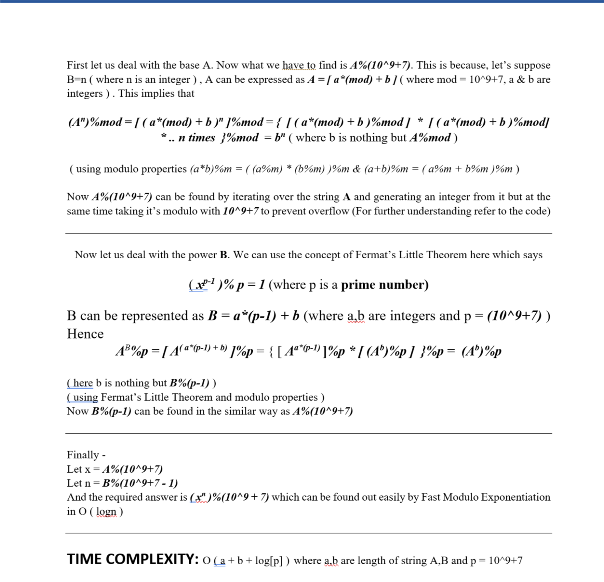

Lights New Car Hacker Blocks Problem based on Number Theory Concepts.


Read and Try **Lights New Car** first yourself.
[Try now at **HackerBlocks**](https://hack.codingblocks.com/practice-section/p/66/92)


Video Solution by **Prateek Narang**
Editorial by **Suransh Chopra**

#### **Difficulty**: 
Medium

#### **Concepts Used**:
Fast Modulo Exponentiation, Modulo Properties, Fermat’s Little Theorem

#### **Statement**:
Given A and B, we have to find (A power B) % (10^9 + 7) where A, B<=10^100000

#### **Explanation**



#### Tester's Code **Prateek Narang**

**Solution**

```c
#include<bits/stdc++.h>
using namespace std;
typedef long long int ll;
ll mod = 1000000007;

ll stringToInt(string a,ll m){
    ll ans = 0;
    for(int i=0;i<a.size();i++){
        ans += (ans*10)%m  + (a[i]-'0');
        ans %= m;
    }
    return ans;

}

ll fastPower(ll a,ll b,ll m){
    if(b==0){
        return 1;
    }
    ll smallPower = fastPower(a,b/2,m);
    smallPower %=m;
    smallPower = (smallPower*smallPower)%m;

    if(b&1){
        return (smallPower*a)%m;
    }
    return smallPower;

}


int main(){

    int t;
    cin>>t;
    while(t--){
    string a,b;
    cin>>a>>b;

    ll x = stringToInt(a,mod);
    ll y = stringToInt(b,mod-1);

    cout<<fastPower(x,y,mod)<<endl;
    }
return 0;


```
